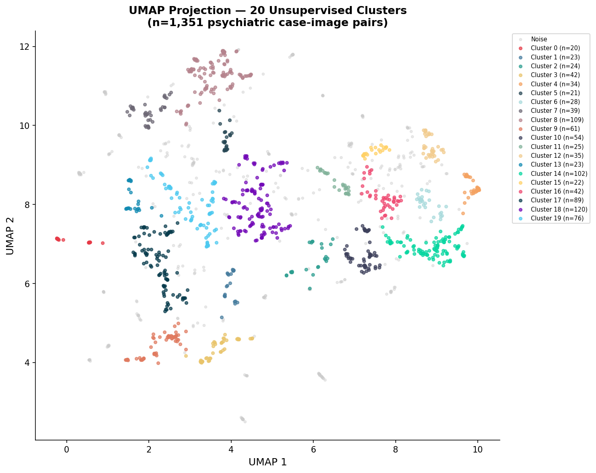
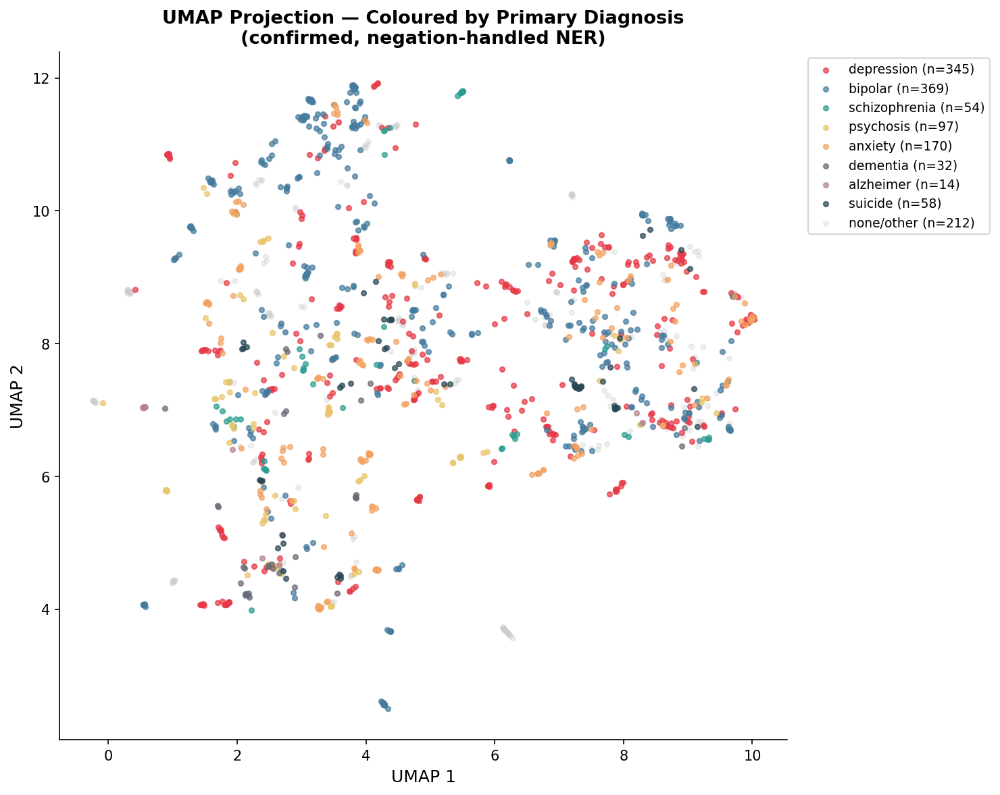
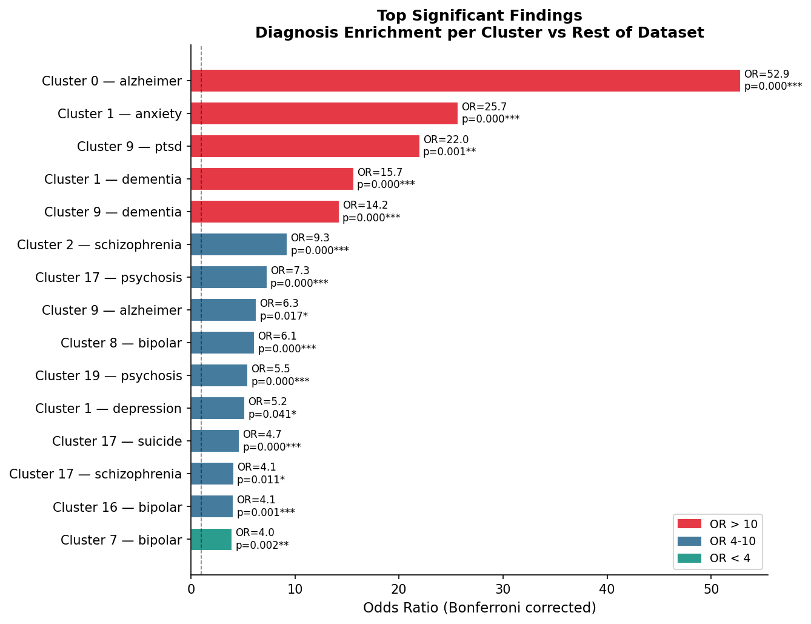
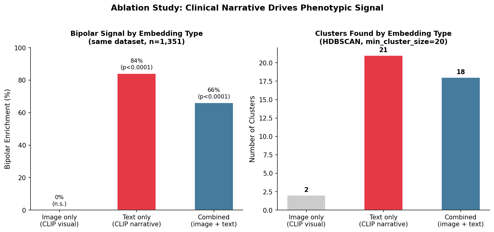
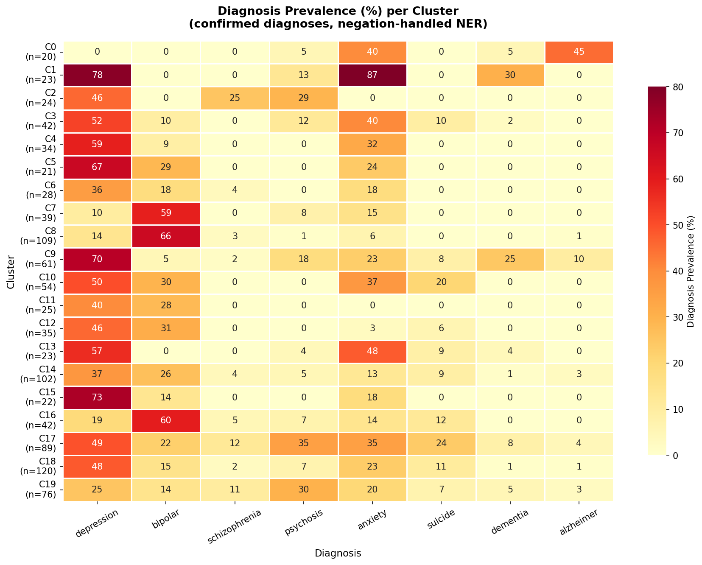

*Preprint — not peer reviewed*

---

## Abstract

Psychiatric diagnosis relies on clinical judgment rather than objective biomarkers, motivating computational approaches to phenotype discovery. We applied unsupervised multimodal clustering to brain-related psychiatric case reports from the MultiCaRe dataset (**n=1,351 case-image pairs from 4,901 unique cases**). Each case was embedded using CLIP (Contrastive Language-Image Pretraining) [@clip2021] to produce combined image-text representations, reduced with UMAP [@umap2018], and clustered with HDBSCAN [@hdbscan2013]. Psychiatric diagnoses were extracted using clinical NER with negation handling (scispacy + negspacy [@scispacy2019]) and cluster enrichment was validated with chi-square tests and Bonferroni correction. We identified **20 clusters**, several with statistically significant diagnosis enrichment: a bipolar-enriched cluster (**OR=6.14, p<0.001**), a depression-dementia co-occurrence cluster (**OR=14.25, p<0.001**), and a severe psychosis-suicide cluster (**OR=7.32, p<0.001**).

To determine the source of this signal, we performed an ablation separating image and text embeddings. The bipolar separation was **absent in image-only clustering** but strongly present in **text-only clustering (84% bipolar enrichment, p<0.0001)**, demonstrating that the observed phenotypes are driven by **clinical narrative** rather than imaging features. External validation on the Consortium for Neuropsychiatric Phenomics (CNP) dataset [@cnp2016] using raw T1w MRI embeddings yielded **ARI=-0.027** and classification accuracy at **chance level (0.250)**, consistent with the absence of detectable diagnostic signal under CLIP-based image embedding.

These findings establish that multimodal clinical case reports are a rich resource for **narrative-driven psychiatric phenotyping**, and highlight a critical gap: general-purpose image embeddings do not capture detectable psychiatric neuroimaging signal. Specialized brain-specific models are needed before imaging can contribute meaningfully to unsupervised psychiatric subtyping.

---

## 1. Introduction

Psychiatric disorders affect over **1 billion people worldwide** and represent a leading cause of disability. Despite decades of neuroimaging research, no reliable imaging biomarkers have been established for routine clinical use. Diagnosis relies on clinical interviews, symptom checklists, and clinician judgment, leading to high rates of misdiagnosis and delayed treatment.

Unsupervised machine learning applied to clinical data has shown promise in identifying psychiatric subtypes that cut across traditional diagnostic boundaries. Prior work has identified biotypes of depression using resting-state fMRI [@drysdale2017], subgroups of schizophrenia using structural MRI [@clementz2016], and imaging-defined subtypes of Alzheimer's disease. However, these studies typically require large, carefully curated datasets with confirmed diagnoses, standardized imaging protocols, and institutional data access.

The MultiCaRe dataset [@multicare2023] offers an alternative starting point: a large open-access collection of over **93,000 clinical case reports** from PubMed Central, each containing clinical narrative text, associated images, image captions, and metadata. While case reports are not representative of the general clinical population, they represent a rich and underutilised resource for hypothesis generation and methodology development.

In this work, we present an unsupervised multimodal clustering analysis of psychiatric case reports from MultiCaRe. We combine image and text embeddings, apply density-based clustering, extract confirmed psychiatric diagnoses using clinical NLP, and statistically validate cluster enrichment. Critically, we perform ablation experiments to determine the relative contribution of imaging versus narrative signal, and validate our approach on an independent dataset with confirmed DSM diagnoses.

Our central finding is that the observed phenotypic structure is **driven by clinical narrative text, not brain imaging**. We discuss the implications for both clinical NLP and psychiatric neuroimaging, and propose specific directions for future work using brain-specific models.

---

## 2. Methods

### 2.1 Dataset

We used MultiCaRe v2.0 [@multicare2023], downloaded via the official `multiversity` Python toolkit. The full dataset contains **93,000+ clinical cases** and **130,000+ images** derived from open-access PubMed Central articles.

We filtered to a psychiatric brain imaging subset using the following criteria:

- Adult cases (age ≥ 18)
- Case text or image caption contains at least one psychiatric term (schizophrenia, bipolar, mania, depression, psychosis, anxiety, PTSD, OCD, suicidal, self-harm)
- Image label indicates brain or head imaging (MRI, CT, head, brain, neuro, radiology)

This yielded 5,449 psychiatric cases. After joining against full image metadata filtered to head/brain radiology and resolving file paths, our final dataset contained **1,351 case-image pairs** across **4,901 unique cases**. Imaging modalities: MRI (n=846, **62.6%**), CT (n=378, 28.0%), PET (n=57, 4.2%), SPECT (n=38, 2.8%), X-ray (n=32, 2.4%).

### 2.2 Multimodal Embedding

Each case-image pair was embedded using CLIP ViT-B/32 [@clip2021]:

- **Image embedding:** CLIP vision encoder → 512-dim L2-normalised vector
- **Text embedding:** First 1,000 characters of case text concatenated with first 500 characters of image caption → CLIP text encoder → 512-dim L2-normalised vector
- **Combined embedding:** Concatenated → **1,024-dim representation**

### 2.3 Clustering

Combined embeddings were standardised (StandardScaler), reduced with UMAP [@umap2018] (n_neighbors=15, min_dist=0.05, cosine metric, random_state=42), and clustered with HDBSCAN [@hdbscan2013] (min_cluster_size=20, min_samples=5), producing **20 clusters with 26.8% noise**.

### 2.4 Diagnosis Extraction

Psychiatric diagnoses were extracted using scispacy [@scispacy2019] with negspacy negation detection across **10 diagnostic categories**: depression, bipolar, schizophrenia, psychosis, anxiety, PTSD, OCD, suicidality, dementia, and Alzheimer's disease. Negated mentions (e.g. "no history of depression"), family history, and rule-out language were excluded to capture only confirmed patient diagnoses.

### 2.5 Statistical Validation

Chi-square tests compared diagnosis prevalence per cluster versus the rest of the dataset. Odds ratios with continuity correction were computed. **Bonferroni correction** was applied across **200 tests** (20 clusters × 10 diagnoses). Significance threshold: p_corrected < 0.05.

### 2.6 Ablation: Image vs Text Signal

To isolate the source of clustering signal, UMAP + HDBSCAN was re-run separately on:

- **Image-only embeddings** (dimensions 0–511)
- **Text-only embeddings** (dimensions 512–1,023)
- **Combined embeddings** (all 1,024 dimensions)

All three conditions used the identical dataset (**n=1,351**) and identical hyperparameters.

### 2.7 External Validation (CNP Dataset)

We validated on the Consortium for Neuropsychiatric Phenomics (CNP, OpenNeuro ds000030 [@cnp2016]): **265 subjects** with confirmed DSM diagnoses (**125 controls, 50 schizophrenia, 49 bipolar, 41 ADHD**). T1w structural MRI scans were downloaded, axial/sagittal/coronal slices extracted, and embedded with CLIP plus a **48-dimensional ROI brain fingerprint** using the Harvard-Oxford cortical atlas via nilearn [@nilearn2014]. Evaluation metrics: Adjusted Rand Index (ARI), Normalized Mutual Information (NMI), and 5-fold cross-validated logistic regression balanced accuracy.

---

## 3. Results

### 3.1 Cluster Structure

UMAP + HDBSCAN produced **20 clusters** from 1,351 case-image pairs (**362 noise points, 26.8%**). Cluster sizes ranged from 20 to 120 cases. Figure 1 shows the UMAP projection coloured by cluster; Figure 2 shows the same projection coloured by primary confirmed diagnosis.

### 3.2 Statistically Significant Phenotypes

After Bonferroni correction, **20 cluster × diagnosis combinations** reached significance. Figure 3 shows the top findings ranked by odds ratio; Figure 5 shows the full diagnosis prevalence heatmap across all clusters.

**Table 1.** Key significant findings (Bonferroni corrected). OR = odds ratio; enriched clusters show OR > 1, depleted show OR < 1.

| Cluster | n | Diagnosis | % cluster | % rest | OR | p (corrected) |
|---------|---|-----------|-----------|--------|----|---------------|
| **8** | **109** | **bipolar** | **66.1%** | 23.9% | **6.14** | **<0.001** |
| 8 | 109 | depression | 13.8% | 42.3% | **0.22** | <0.001 |
| **7** | **39** | **bipolar** | **59.0%** | 26.4% | **3.97** | **0.002** |
| 7 | 39 | depression | 10.3% | 40.9% | 0.18 | 0.026 |
| **9** | **61** | **depression** | **70.5%** | 38.5% | **3.75** | **<0.001** |
| **9** | **61** | **dementia** | **24.6%** | 2.2% | **14.25** | **<0.001** |
| **9** | **61** | **PTSD** | **4.9%** | 0.2% | **22.01** | **0.001** |
| **17** | **89** | **psychosis** | **34.8%** | 6.8% | **7.32** | **<0.001** |
| **17** | **89** | **suicide** | **23.6%** | 6.3% | **4.67** | **<0.001** |
| 17 | 89 | schizophrenia | 12.4% | 3.4% | 4.11 | 0.011 |
| **0** | **20** | **alzheimer** | **45.0%** | 1.5% | **52.85** | **<0.001** |

### 3.3 Ablation: Signal Source

**Table 2.** Ablation study — source of bipolar enrichment signal. Same dataset (n=1,351) and identical hyperparameters across all three conditions.

| Condition | Clusters found | Bipolar enrichment |
|-----------|---------------|---------------------|
| **Image only** | **2** | **None detected (n.s.)** |
| **Text only** | **21** | **84% bipolar, p<0.0001** |
| Combined | 18 | 59–66% bipolar, p<0.0001 |

Image-only clustering produced only **2 undifferentiated clusters** with no diagnostic enrichment. Text-only clustering recovered a strongly bipolar-enriched cluster (**84%, p<0.0001**). The phenotypic signal is **text-driven**.

### 3.4 External Validation on CNP

**Table 3.** CNP validation metrics (n=265, confirmed DSM diagnoses, 4 diagnostic classes).

| Metric | Value | Interpretation |
|--------|-------|----------------|
| **ARI** | **-0.027** | Random cluster-diagnosis alignment |
| NMI | 0.062 | Minimal mutual information |
| **Balanced accuracy** | **0.250** | **Exactly chance level (chance = 0.250)** |

Raw T1w MRI embeddings did not recover diagnostic groupings. Classification accuracy at chance level indicates that **CLIP-based image embeddings, under this experimental design, do not carry detectable psychiatric diagnostic signal**. This result is consistent with the ablation finding and does not imply that neuroimaging signal is absent in psychiatric disorders more generally.

---

## 4. Discussion

### 4.1 Clinical Narrative as a Phenotyping Signal

The text-only ablation recovered an **84% bipolar-enriched cluster (p<0.0001)** that was entirely absent in image-only clustering. This demonstrates that clinical case report text encodes **strong, structured diagnostic signal**. Psychiatrists describe bipolar disorder cases using systematically different language than depression cases — different symptom profiles, treatment histories, and clinical trajectories — and CLIP's text encoder captures this structure.

This finding has direct implications for clinical NLP. Large language models applied to psychiatric clinical notes, discharge summaries, or structured case reports may be a productive path toward computational psychiatric phenotyping **without requiring neuroimaging data**.

### 4.2 Limitations of General-Purpose Image Embeddings for Psychiatry

CLIP was trained on natural image-text pairs from the internet and does not encode the subtle structural brain differences — cortical thickness variations, white matter integrity, subcortical volume changes — that distinguish psychiatric conditions. Our CNP validation confirms this: **chance-level classification accuracy across all four diagnostic groups**.

Importantly, this is not a finding that psychiatric neuroimaging signal does not exist — the literature clearly demonstrates it does [@drysdale2017; @clementz2016]. Rather, it is a finding that **CLIP is the wrong tool for psychiatric MRI**, and that general-purpose vision models should not be assumed to transfer to medical neuroimaging without domain-specific adaptation.

### 4.3 Future Work: Brain-Specific Models

For imaging signal to contribute to psychiatric phenotyping, future work should use:

1. **FreeSurfer-derived features** — cortical thickness, subcortical volumes, surface area; well-validated in psychiatric neuroimaging
2. **Voxel-based morphometry (VBM)** — whole-brain grey matter density maps; sensitive to subtle structural differences
3. **Brain foundation models** — models pretrained specifically on neuroimaging data, which encode brain-specific rather than natural image statistics
4. **Larger datasets** — UK Biobank (n=40,000+) for the statistical power needed to detect reliable psychiatric subtypes

### 4.4 Limitations

1. **Dataset bias:** MultiCaRe case reports represent unusual or instructive clinical presentations, not routine psychiatric practice. Findings may not generalise to the broader clinical population.
2. **Sample size:** 1,351 case-image pairs total; individual clusters as small as n=20 have limited statistical power.
3. **NER limitations:** Clinical NER with scispacy is imperfect for complex clinical language; some diagnoses may be missed or misattributed.
4. **Imaging model:** The negative CNP result reflects CLIP's architectural limitations, not the absence of neuroimaging signal in psychiatric disorders.
5. **No prospective validation:** All findings are retrospective and hypothesis-generating.

---

## 5. Conclusion

Unsupervised clustering of **1,351 multimodal psychiatric case reports** produces clinically coherent phenotypes with statistically significant diagnosis enrichment surviving Bonferroni correction. Ablation experiments and external validation on **265 CNP subjects with confirmed DSM diagnoses** demonstrate that this signal originates from **clinical narrative text**, not brain imaging features. These findings establish the value of case report text for narrative-driven psychiatric phenotyping, while highlighting the need for brain-specific neuroimaging models to unlock imaging-driven psychiatric subtyping.

Code, data, and results are openly available at: <https://github.com/AliBaig-xD/multicare-psych>

---

## Acknowledgements

The author used Claude (Anthropic) as an AI research assistant throughout this work, for experimental design, code generation, debugging, and manuscript preparation. All scientific decisions, interpretations, and responsibility for the work remain with the author.

*Data sources:* MultiCaRe v2.0 [@multicare2023]; CNP dataset via OpenNeuro ds000030 [@cnp2016].

---

## References
